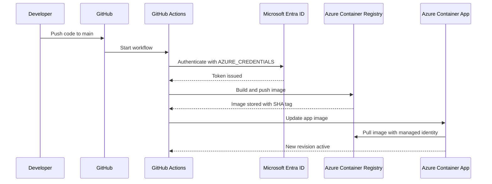

# Azure Container Apps CI/CD Guide for `sampleappdev`

## Purpose

This guide explains how to build a Python application, commit it to Git, push it to GitHub, build and push a container image to Azure Container Registry, and deploy it to Azure Container Apps with GitHub Actions. It is written so a new DevOps engineer can follow both Azure Portal and Azure CLI paths end to end. [web:114][web:279][web:397]

## Solution flow

1. Developer writes Python code locally.
2. Developer initializes Git and pushes code to GitHub.
3. GitHub Actions starts on push to `main`.
4. Workflow logs in to Azure using `AZURE_CREDENTIALS`.
5. Azure builds the container image in ACR.
6. Azure Container Apps updates to the new image.
7. The Container Apps environment identity pulls the private image with `AcrPull`. [web:114][web:279][web:397][web:428]

### Architecture diagram


### CI/CD diagram



---

## Required resources

You need these Azure resources:

- Resource group: `RG-SAMPLE-DEV`.
- Azure Container Registry: `sampledevacr`.
- Container Apps environment: `sampleapp-env`.
- Container App: `sampleappdev`.
- Container name in the app: `sampleappcontainer`. [web:397][web:428]

---

## Python app setup

Your app should listen on port `8080`, because the deployment expects that port for ingress. [web:114]

### Example structure

```text
sample-app/
├── app.py
├── requirements.txt
├── Dockerfile
├── .github/
│   └── workflows/
│       └── azure-container-apps.yml
└── README.md
```

### Example `app.py`

```python
from flask import Flask

app = Flask(__name__)

@app.get("/")
def home():
    return {"status": "ok", "service": "sampleappdev"}
```

### Example `requirements.txt`

```txt
Flask==3.1.3
gunicorn==23.0.0
```

### Example `Dockerfile`

```dockerfile
FROM python:3.11-slim

WORKDIR /app

COPY requirements.txt .
RUN pip install --no-cache-dir -r requirements.txt gunicorn

COPY . .

EXPOSE 8080

CMD ["gunicorn", "--bind", "0.0.0.0:8080", "app:app"]
```

---

## Create Azure resources in Portal

### 1) Create the resource group

1. Open **Azure Portal**.
2. Search **Resource groups**.
3. Click **Create**.
4. Select your subscription.
5. Enter `RG-SAMPLE-DEV`.
6. Choose a region.
7. Click **Review + create**.
8. Click **Create**. [web:279][web:397]

### CLI alternative

```bash
az group create \
  --name RG-SAMPLE-DEV \
  --location uae north
```

---

### 2) Create Azure Container Registry

1. Search **Container registries**.
2. Click **Create**.
3. Select subscription and resource group `RG-SAMPLE-DEV`.
4. Enter registry name `sampledevacr`.
5. Pick a region.
6. Choose **Standard** SKU.
7. Leave **Admin user** disabled.
8. Click **Review + create** and then **Create**. [web:428][web:397]

### CLI alternative

```bash
az acr create \
  --resource-group RG-SAMPLE-DEV \
  --name sampledevacr \
  --sku Standard
```

---

### 3) Create the Container Apps environment

1. Search **Container Apps**.
2. Click **Create**.
3. Choose **Container Apps environment**.
4. Select `RG-SAMPLE-DEV`.
5. Name it `sampleapp-env`.
6. Choose region.
7. Create or select a **Log Analytics workspace**.
8. Click **Create** and wait. [web:397][web:405][web:464]

### CLI alternative

```bash
az containerapp env create \
  --name sampleapp-env \
  --resource-group RG-SAMPLE-DEV \
  --location uae north
```

---

### 4) Create the Container App

1. Open **Container Apps**.
2. Click **Create** → **Container App**.
3. Choose environment `sampleapp-env`.
4. Name the app `sampleappdev`.
5. Set ingress as needed.
6. Set target port to `8080`.
7. Create the app. [web:114][web:397]

### CLI alternative

```bash
az containerapp create \
  --name sampleappdev \
  --resource-group RG-SAMPLE-DEV \
  --environment sampleapp-env \
  --image mcr.microsoft.com/azuredocs/containerapps-helloworld:latest \
  --target-port 8080 \
  --ingress external
```

---

## Microsoft Entra app and secret

### Create app registration in Portal

1. Open **Microsoft Entra ID**.
2. Go to **App registrations**.
3. Click **New registration**.
4. Name it `sampleappdev-github-actions`.
5. Click **Register**. [web:279]

### Get IDs

On the app Overview page:
- Copy **Application (client) ID**.
- Copy **Directory (tenant) ID**. [web:279]

From Azure CLI:

```bash
az ad app list --display-name sampleappdev-github-actions --query "[0].appId" -o tsv
az account show --query tenantId -o tsv
az account show --query id -o tsv
```

### Create client secret

1. Open the app registration.
2. Go to **Certificates & secrets**.
3. Under **Client secrets**, click **New client secret**.
4. Add description `github-actions-secret`.
5. Click **Add**.
6. Copy the **Value** immediately. [web:279]

### CLI alternative

```bash
az ad sp create-for-rbac \
  --name sampleappdev-github-actions \
  --role Contributor \
  --scopes /subscriptions/<subscription-id>/resourceGroups/RG-SAMPLE-DEV
```

---

## Create GitHub secret

### Portal steps

1. Open your GitHub repository.
2. Click **Settings**.
3. Go to **Secrets and variables**.
4. Choose **Actions**.
5. Click **New repository secret**.
6. Set name to `AZURE_CREDENTIALS`.
7. Paste this JSON:

```json
{
  "clientId": "YOUR_APPLICATION_CLIENT_ID",
  "clientSecret": "YOUR_CLIENT_SECRET_VALUE",
  "subscriptionId": "YOUR_SUBSCRIPTION_ID",
  "tenantId": "YOUR_TENANT_ID"
}
```

8. Save the secret. [web:279]

### What each field means

- `clientId`: App registration Application ID.
- `clientSecret`: Secret value from Entra ID.
- `subscriptionId`: Azure subscription GUID.
- `tenantId`: Tenant GUID. [web:279]

---

## Set up AcrPull

### Why not AcrPush?

For this pipeline, `AcrPush` is not required for runtime deployment. The workflow builds and pushes the image through `az acr build`, while the deployed Container App only needs to **pull** the image. The important role for the Container Apps environment is `AcrPull`. [web:428][web:397]

### Portal steps to assign AcrPull

1. Open **Azure Container Registry** `sampledevacr`.
2. Go to **Access control (IAM)**.
3. Click **Add** → **Add role assignment**.
4. Select **AcrPull**.
5. Click **Next**.
6. Under **Members**, choose **Managed identity**.
7. Select the Container Apps environment identity for `sampleapp-env`.
8. Click **Review + assign**. [web:387][web:397][web:428]

### CLI alternative

```bash
ENV_PRINCIPAL_ID=$(az containerapp env show -n sampleapp-env -g RG-SAMPLE-DEV --query identity.principalId -o tsv)
ACR_ID=$(az acr show -n sampledevacr --query id -o tsv)

az role assignment create \
  --assignee "$ENV_PRINCIPAL_ID" \
  --scope "$ACR_ID" \
  --role AcrPull
```

### Verify it

```bash
az role assignment list \
  --assignee "$ENV_PRINCIPAL_ID" \
  --scope "$ACR_ID" \
  --role AcrPull \
  -o table
```

---

## Final workflow file

```yaml
name: Trigger auto deployment for sampleappdev

on:
  push:
    branches:
      - main
    paths:
      - '**'
      - '.github/workflows/azure-container-apps.yml'
  workflow_dispatch:

permissions:
  contents: read
  id-token: write

jobs:
  build-and-deploy:
    runs-on: ubuntu-latest

    steps:
      - name: Checkout code
        uses: actions/checkout@v4

      - name: Azure Login
        uses: azure/login@v2
        with:
          creds: ${{ secrets.AZURE_CREDENTIALS }}

      - name: Build and Push Image to ACR
        run: |
          az acr build \
            --registry sampledevacr \
            --image sampleappdev:${{ github.sha }} \
            .

      - name: Deploy to Azure Container App
        run: |
          az containerapp update \
            --name sampleappdev \
            --resource-group RG-SAMPLE-DEV \
            --container-name sampleappcontainer \
            --image sampledevacr.azurecr.io/sampleappdev:${{ github.sha }} \
            --no-wait
```

---

## First push from your computer

### Initialize Git

```bash
git init
git config --global user.name "Your Name"
git config --global user.email "you@example.com"
git remote add origin https://github.com/<user-or-org>/<repo>.git
```

### First commit and push

```bash
git add .
git commit -m "Initial commit"
git branch -M main
git push -u origin main
```

---

## Future changes from your computer

For later edits:

```bash
git add .
git commit -m "Update app logic"
git push
```

If using a feature branch:

```bash
git checkout -b feature/change-1
git add .
git commit -m "Update feature"
git push -u origin feature/change-1
```

---

## Monitor deployment

### In GitHub Actions

1. Open repository **Actions**.
2. Click the latest workflow run.
3. Watch the logs for:
   - Checkout code.
   - Azure Login.
   - ACR build.
   - Container App update. [web:114][web:464][web:467]

### What success looks like

- Azure login succeeds.
- Image builds and pushes into ACR.
- Container App update succeeds.
- A new revision becomes active. [web:114][web:397]

### If deployment fails

Use the logs to identify whether the failure is:
- Login/authentication.
- ACR build/push.
- Container App revision update.
- Image pull authorization. [file:461][file:462][file:463]

---

## Validate the deployed app

Validation should confirm both that the app is live and that it returns the expected response.

### Portal validation

1. Open **Container Apps**.
2. Open `sampleappdev`.
3. Copy the app URL.
4. Open the URL in your browser.
5. Confirm the app returns the expected response, for example JSON from `/`. [web:397][web:464]

### CLI validation

```bash
az containerapp show -n sampleappdev -g RG-SAMPLE-DEV --query properties.configuration.ingress.fqdn -o tsv
```

Then test it:

```bash
curl https://<fqdn>/
```

If your app exposes a `/health` endpoint, test that too:

```bash
curl https://<fqdn>/health
```

### What to confirm

- HTTP response is 200.
- Response body matches the deployed version.
- The latest Git SHA or build version is visible if your app reports it. [web:464][web:467]

---

## How the deployer monitors the app

### Portal monitoring

1. Open the Container App.
2. Go to **Revisions and replicas**.
3. Confirm the newest revision is active.
4. Go to **Log stream** to see live logs.
5. Go to **Metrics** to inspect request count, CPU, memory, and failures. [web:464][web:467][web:473]

### CLI monitoring

```bash
az containerapp logs show -n sampleappdev -g RG-SAMPLE-DEV
az containerapp revision list -n sampleappdev -g RG-SAMPLE-DEV -o table
```

### Log Analytics

Azure Container Apps sends application and system logs to Log Analytics. Use the workspace linked to the environment to query system and console logs, especially when diagnosing failed revisions. [web:464][web:465][web:467]

---

## Troubleshooting lessons

### Unauthorized image push
Earlier failures showed the image push step could fail with insufficient scopes. That was a build/push identity issue, not a runtime `AcrPush` requirement for the app itself. [file:461][file:462]

### Image pull failure
The common runtime problem was missing `AcrPull` on the Container Apps environment identity. [web:397][web:428]

### Secret problems
A wrong or missing `AZURE_CREDENTIALS` secret prevents Azure login. [web:279]

### Revision failures
If a revision fails, check revision details, system logs, and log stream to find the failing container message. [web:464][web:469][web:475]

### RBAC propagation
After role assignment, wait a few minutes before retrying because Azure RBAC may not be immediate. [web:428]

---

## Final checklist

- Python app runs locally.
- Dockerfile builds.
- Git repo initialized.
- Code pushed to GitHub `main`.
- GitHub secret `AZURE_CREDENTIALS` created.
- Entra app registration created.
- Client secret value copied.
- Subscription ID copied.
- Container Apps environment created.
- `AcrPull` assigned to environment identity.
- Workflow file committed.
- GitHub Actions run succeeds.
- Deployed app URL returns expected response.
- Logs and revisions are monitored after deployment. [web:279][web:397][web:428][web:464]

This version removes the earlier business name entirely and replaces it with a dummy project reference throughout.
