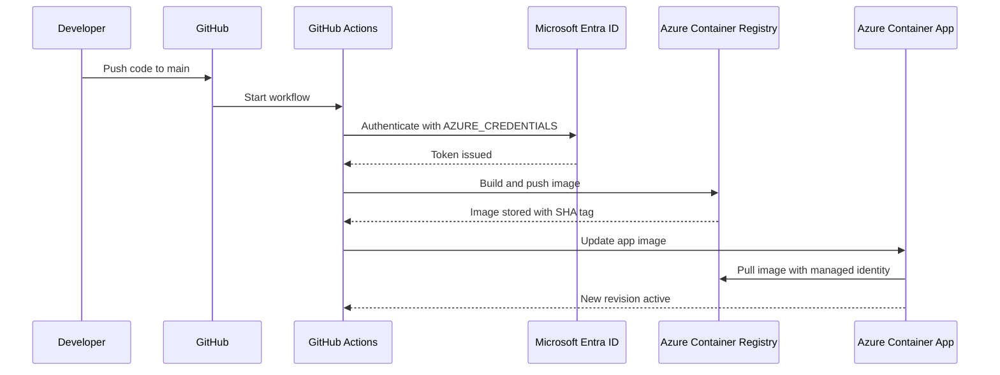

## Azure Container Apps CI/CD Guide

Build a Python app, push code to GitHub, build/push a container image to Azure Container Registry (ACR), and deploy to Azure Container Apps using GitHub Actions.

---

#### Solution Flow

1. Developer writes code locally  
2. Initialize Git and push code to GitHub  
3. GitHub Actions triggers on push to `main`  
4. Workflow logs in to Azure using `AZURE_CREDENTIALS`  
5. Azure builds the container image in ACR  
6. Azure Container Apps updates to the new image  
7. Container Apps environment pulls the private image using `AcrPull`

---

#### Architecture Diagram


---

#### CI/CD Diagram



---

#### Step 1 — Create Resource Group

1. Open **Azure Portal**
2. Search **Resource groups**
3. Click **Create**
4. Select subscription
5. Enter `RG-SAMPLE-DEV`
6. Choose region
7. Click **Review + create**
8. Click **Create**

---

#### Step 2 — Create Azure Container Registry

1. Search **Container registries**
2. Click **Create**
3. Select resource group `RG-SAMPLE-DEV`
4. Registry name: `sampledevacr`
5. Choose region
6. Select **Standard** SKU
7. Keep **Admin user** disabled
8. Click **Create**

---

#### Step 3 — Create Container Apps Environment

1. Search **Container Apps**
2. Click **Create**
3. Choose **Container Apps environment**
4. Select `RG-SAMPLE-DEV`
5. Name: `sampleapp-env`
6. Choose region
7. Create/select **Log Analytics workspace**
8. Click **Create**

---

#### Step 4 — Create Container App

1. Open **Container Apps**
2. Click **Create → Container App**
3. Select environment `sampleapp-env`
4. App name: `sampleappdev`
5. Configure ingress
6. Set target port to `8080`
7. Create app

---

#### Step 5 — Create Microsoft Entra App Registration

1. Open **Microsoft Entra ID**
2. Go to **App registrations**
3. Click **New registration**
4. Name: `sampleappdev-github-actions`
5. Click **Register**

##### Required IDs

Copy from the app overview:

- **Application (client) ID**
- **Directory (tenant) ID**

##### Create Client Secret

1. Open app registration
2. Go to **Certificates & secrets**
3. Under **Client secrets**, click **New client secret**
4. Description: `github-actions-secret`
5. Click **Add**
6. Copy the secret **Value**

---

#### Step 6 — Create GitHub Secret

1. Open GitHub repository
2. Go to **Settings**
3. Open **Secrets and variables → Actions**
4. Click **New repository secret**
5. Name: `AZURE_CREDENTIALS`
6. Paste:

```json
{
  "clientId": "YOUR_APPLICATION_CLIENT_ID",
  "clientSecret": "YOUR_CLIENT_SECRET_VALUE",
  "subscriptionId": "YOUR_SUBSCRIPTION_ID",
  "tenantId": "YOUR_TENANT_ID"
}
```

---

#### Step 7 — Create Workflow File

> Optional if already included in source code.

1. Open repository
2. Go to `.github/workflows/`
3. Create `azure-container-apps.yml`
4. Paste workflow content
5. Commit to `main`

---

#### Step 8 — Assign `AcrPull`

##### Why not `AcrPush`?

`AcrPush` is **not required at runtime**.  
The pipeline pushes images using `az acr build`.

The deployed Container App only needs:

- `AcrPull`

##### Assign Role

1. Open ACR `sampledevacr`
2. Go to **Access control (IAM)**
3. Click **Add → Add role assignment**
4. Select **AcrPull**
5. Click **Next**
6. Choose **Managed identity**
7. Select identity for `sampleapp-env`
8. Click **Review + assign**

---

#### Step 9 — Deployment

##### Initialize Git

```bash
git init
git config --global user.name "Your Name"
git config --global user.email "you@example.com"
git remote add origin https://github.com/<user-or-org>/<repo>.git
```

##### First Push

```bash
git add .
git commit -m "Initial commit"
git branch -M main
git push -u origin main
```

##### Future Changes

```bash
git add .
git commit -m "Update app logic"
git push
```

Feature branch example:

```bash
git checkout -b feature/change-1
git add .
git commit -m "Update feature"
git push -u origin feature/change-1
```

---

#### Step 10 — Monitor Deployment

##### GitHub Actions

1. Open repository **Actions**
2. Open latest workflow run
3. Monitor logs:
   - Checkout code
   - Azure Login
   - ACR build
   - Container App update

##### Success Criteria

- Azure login succeeds  
- Image builds and pushes to ACR  
- Container App update succeeds  
- New revision becomes active  

##### Failure Areas

- Authentication
- ACR build/push
- Revision update
- Image pull authorization

---

#### Step 11 — Validate Deployment

Validation confirms the app is live and responding correctly.

##### Portal Validation

1. Open **Container Apps**
2. Open `sampleappdev`
3. Copy app URL
4. Open in browser
5. Verify HTTP response `200`

##### Log Analytics

Use Log Analytics to inspect:

- Application logs
- System logs
- Failed revisions
- Container startup errors

---

#### Troubleshooting Lessons

##### Unauthorized Image Push
Image push failures usually indicate insufficient build permissions.

##### Image Pull Failure
Most common runtime issue: missing `AcrPull`.

##### Secret Problems
Invalid `AZURE_CREDENTIALS` prevents Azure login.

##### Revision Failures
Check revision details and container logs.

##### RBAC Propagation
> Azure RBAC role assignments may take several minutes to become active.
