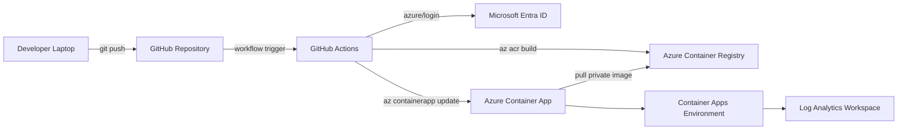
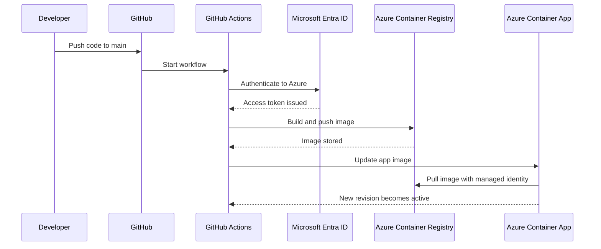

# Azure Container Apps CI/CD Guide

Deploy a Python application to **Azure Container Apps** using **GitHub Actions**, **Azure Container Registry (ACR)**, and secure Azure authentication. This guide is written for public Git repositories and is structured for fast onboarding, repeatable deployment, and easier troubleshooting. [web:1][web:14]

---

## Table of Contents

- [Overview](#overview)
- [Architecture](#architecture)
- [Deployment Flow](#deployment-flow)
- [Prerequisites](#prerequisites)
- [Project Structure](#project-structure)
- [Sample Application](#sample-application)
- [Azure Resources](#azure-resources)
- [Identity and Access](#identity-and-access)
- [GitHub Configuration](#github-configuration)
- [GitHub Actions Workflow](#github-actions-workflow)
- [Deployment Procedure](#deployment-procedure)
- [Validation](#validation)
- [Monitoring](#monitoring)
- [Troubleshooting](#troubleshooting)
- [Security Notes](#security-notes)
- [Checklist](#checklist)

---

## Overview

This repository demonstrates a simple CI/CD pattern for deploying a Python web app to Azure Container Apps. On every push to the `main` branch, GitHub Actions authenticates to Azure, builds the container image in Azure Container Registry, and updates the Container App to a new revision. [web:1][web:14]

This design keeps the pipeline simple and production-friendly. The running application pulls the private image from ACR using managed identity permissions, which means you do not need to enable the ACR admin account for runtime access. [web:1][web:15]

---

## Architecture

### Solution flow

1. A developer writes code locally.
2. The code is committed and pushed to GitHub.
3. GitHub Actions starts on push to `main`.
4. The workflow authenticates to Azure.
5. Azure Container Registry builds and stores the image.
6. Azure Container Apps updates the app to the new image.
7. The deployed app pulls the private image from ACR using managed identity with `AcrPull`. [web:1][web:14][web:15]

### Architecture diagram



---

## Deployment Flow

The deployment is event-driven and based on source control. A push to the main branch triggers the workflow, the image is built and tagged, and Azure Container Apps activates a new revision using the updated image. [web:1]

### CI/CD sequence



---

## Prerequisites

Before using this repository, make sure the following are available:

- An Azure subscription.
- A GitHub repository.
- Azure CLI installed locally.
- Git installed locally.
- A Python application that listens on port `8080`.
- Permission to create Azure resources and role assignments. [web:1]

Recommended knowledge:

- Basic Git workflow.
- Basic Docker concepts.
- Familiarity with Azure resource groups, ACR, and Container Apps.

---

## Project Structure

Use a clean and minimal structure like this:

```text
sample-app/
├── app.py
├── requirements.txt
├── Dockerfile
├── .github/
│   └── workflows/
│       └── azure-container-apps.yml
└── README.md
```

This layout keeps the application, container definition, automation workflow, and documentation easy to discover.

---

## Sample Application

Your application must listen on port `8080`, because the Container App ingress configuration is aligned to that port in this guide.

### `app.py`

```python
from flask import Flask

app = Flask(__name__)

@app.get("/")
def home():
    return {"status": "ok", "service": "sampleappdev"}

@app.get("/health")
def health():
    return {"status": "healthy"}
```

### `requirements.txt`

```txt
Flask==3.1.3
gunicorn==23.0.0
```

### `Dockerfile`

```dockerfile
FROM python:3.11-slim

WORKDIR /app

COPY requirements.txt .
RUN pip install --no-cache-dir -r requirements.txt

COPY . .

EXPOSE 8080

CMD ["gunicorn", "--bind", "0.0.0.0:8080", "app:app"]
```

---

## Azure Resources

Create or confirm the following Azure resources:

| Resource | Example name |
|---|---|
| Resource Group | `RG-SAMPLE-DEV` |
| Azure Container Registry | `sampledevacr` |
| Container Apps Environment | `sampleapp-env` |
| Container App | `sampleappdev` |
| Container Name | `sampleappcontainer` |

### Resource creation examples

#### Resource group

```bash
az group create \
  --name RG-SAMPLE-DEV \
  --location "uaenorth"
```

#### Azure Container Registry

```bash
az acr create \
  --resource-group RG-SAMPLE-DEV \
  --name sampledevacr \
  --sku Standard
```

#### Container Apps environment

```bash
az containerapp env create \
  --name sampleapp-env \
  --resource-group RG-SAMPLE-DEV \
  --location "uaenorth"
```

#### Container App

```bash
az containerapp create \
  --name sampleappdev \
  --resource-group RG-SAMPLE-DEV \
  --environment sampleapp-env \
  --image mcr.microsoft.com/azuredocs/containerapps-helloworld:latest \
  --target-port 8080 \
  --ingress external
```

---

## Identity and Access

Azure authentication is a core part of the deployment. GitHub Actions must be able to log in to Azure, and the running Container App must be able to pull private images from ACR. [web:1][web:14][web:15]

### Option A: Recommended for public repositories

Use **OpenID Connect (OIDC)** with `azure/login` instead of storing a long-lived client secret in GitHub. GitHub documents that OIDC with Azure requires `id-token: write`, and Azure Login supports this model. [web:2][web:14]

With this approach, you typically store only:
- `AZURE_CLIENT_ID`
- `AZURE_TENANT_ID`
- `AZURE_SUBSCRIPTION_ID`

### Option B: Service principal secret

You can also use a service principal and store `AZURE_CREDENTIALS` as JSON in GitHub Secrets. This works, but it is less preferred for public-facing repositories because it depends on a long-lived secret. [web:14]

### Required ACR permission for runtime

The deployed application must have `AcrPull` permission on the Azure Container Registry so it can pull the private image. Managed identity plus `AcrPull` is the standard pattern for this scenario. [web:15]

#### Example role assignment

```bash
APP_PRINCIPAL_ID=$(az containerapp show \
  --name sampleappdev \
  --resource-group RG-SAMPLE-DEV \
  --query identity.principalId -o tsv)

ACR_ID=$(az acr show \
  --name sampledevacr \
  --resource-group RG-SAMPLE-DEV \
  --query id -o tsv)

az role assignment create \
  --assignee "$APP_PRINCIPAL_ID" \
  --scope "$ACR_ID" \
  --role AcrPull
```

> Note: In some deployments, identity can be assigned at the app level or through the environment pattern you use. The important requirement is that the identity used for image pull has `AcrPull` on the target registry. [web:15]

---

## GitHub Configuration

### Repository secrets

If you use OIDC, create these repository secrets:

- `AZURE_CLIENT_ID`
- `AZURE_TENANT_ID`
- `AZURE_SUBSCRIPTION_ID`

If you use service principal JSON instead, create:

- `AZURE_CREDENTIALS`

### Workflow permissions

Your GitHub Actions workflow should include:

```yaml
permissions:
  contents: read
  id-token: write
```

`id-token: write` is required for GitHub OIDC authentication to Azure. [web:2][web:14]

---

## GitHub Actions Workflow

Below is a clean workflow using **OIDC**, which is the recommended model for public repositories and modern Azure deployments. GitHub and Azure both document this pattern for `azure/login`. [web:2][web:14]

```yaml
name: Deploy to Azure Container Apps

on:
  push:
    branches:
      - main
  workflow_dispatch:

permissions:
  contents: read
  id-token: write

jobs:
  build-and-deploy:
    runs-on: ubuntu-latest

    steps:
      - name: Checkout code
        uses: actions/checkout@v4

      - name: Azure login
        uses: azure/login@v2
        with:
          client-id: ${{ secrets.AZURE_CLIENT_ID }}
          tenant-id: ${{ secrets.AZURE_TENANT_ID }}
          subscription-id: ${{ secrets.AZURE_SUBSCRIPTION_ID }}

      - name: Build and push image to ACR
        run: |
          az acr build \
            --registry sampledevacr \
            --image sampleappdev:${{ github.sha }} \
            .

      - name: Enable managed identity on Container App
        run: |
          az containerapp identity assign \
            --name sampleappdev \
            --resource-group RG-SAMPLE-DEV \
            --system-assigned

      - name: Deploy image to Azure Container Apps
        run: |
          az containerapp update \
            --name sampleappdev \
            --resource-group RG-SAMPLE-DEV \
            --image sampledevacr.azurecr.io/sampleappdev:${{ github.sha }}
```

### If you must use `AZURE_CREDENTIALS`

Use this login block instead:

```yaml
      - name: Azure login
        uses: azure/login@v2
        with:
          creds: ${{ secrets.AZURE_CREDENTIALS }}
```

---

## Deployment Procedure

### 1. Initialize Git locally

```bash
git init
git config --global user.name "Your Name"
git config --global user.email "you@example.com"
git remote add origin https://github.com/<user-or-org>/<repo>.git
```

### 2. Create the first commit

```bash
git add .
git commit -m "Initial commit"
git branch -M main
git push -u origin main
```

### 3. Confirm the workflow starts

Open the **Actions** tab in GitHub and verify the workflow is triggered after the push.

### 4. Confirm the image is built

Check that the image appears in Azure Container Registry with a tag that matches the Git commit SHA.

### 5. Confirm the app is updated

Verify that Azure Container Apps creates a new revision and marks it active. Azure documents GitHub Actions deployment support for Container Apps, and revision-based rollout is part of the service deployment model. [web:1]

---

## Validation

Validation should check both availability and correctness.

### Get the app FQDN

```bash
az containerapp show \
  --name sampleappdev \
  --resource-group RG-SAMPLE-DEV \
  --query properties.configuration.ingress.fqdn -o tsv
```

### Test the root endpoint

```bash
curl https://<fqdn>/
```

### Test the health endpoint

```bash
curl https://<fqdn>/health
```

### Expected results

- HTTP 200 response.
- JSON payload from `/`.
- Health response from `/health`.
- New revision visible in Azure after deployment.

---

## Monitoring

Azure Container Apps supports revision inspection, live logs, and platform metrics. Azure’s Container Apps deployment guidance also ties GitHub Actions deployments to revision updates, so revision state is one of the first places to check after a rollout. [web:1]

### Useful commands

```bash
az containerapp logs show \
  --name sampleappdev \
  --resource-group RG-SAMPLE-DEV
```

```bash
az containerapp revision list \
  --name sampleappdev \
  --resource-group RG-SAMPLE-DEV \
  -o table
```

### What to monitor

- Active revision status.
- Application startup logs.
- Image pull errors.
- Request count, failures, CPU, and memory.
- Log Analytics records from the Container Apps environment.

---

## Troubleshooting

### Azure login fails

Common causes:
- Wrong client, tenant, or subscription values.
- Missing `id-token: write` permission for OIDC.
- Missing or malformed `AZURE_CREDENTIALS` JSON when using secret-based auth. [web:2][web:14]

### Image build fails

Common causes:
- Dockerfile issues.
- Missing application files.
- Invalid Python dependencies.
- Incorrect ACR name in `az acr build`.

### Container App cannot pull image

This is usually an identity or RBAC problem. Make sure the identity used by the Container App has `AcrPull` on the target registry. [web:15]

### New revision does not become healthy

Check:
- Container logs.
- Port binding, confirm the app listens on `0.0.0.0:8080`.
- Startup command.
- Health endpoint behavior.
- Revision details in the Azure portal.

### RBAC changes do not work immediately

Role assignment propagation can take a short time. Retry after a few minutes if `AcrPull` was assigned very recently.

---

## Security Notes

For public repositories, avoid committing tenant IDs, subscription IDs, app IDs, or registry names unless they are intentionally public examples. Prefer placeholders in documentation and keep real values in GitHub Secrets or environment-specific deployment configuration. [web:2][web:14]

Prefer **OIDC** over client secrets for GitHub-to-Azure authentication. This reduces secret management risk and aligns with GitHub and Azure guidance for modern deployment workflows. [web:2][web:14]

Do not enable the ACR admin user unless you have a specific operational need. Managed identity with `AcrPull` is the cleaner runtime pattern for Container Apps consuming private images. [web:15]

---

## Checklist

Use this checklist before declaring the deployment complete:

- [ ] Python app runs locally on port `8080`
- [ ] Docker image builds successfully
- [ ] Git repository is initialized
- [ ] Code is pushed to GitHub
- [ ] GitHub Actions workflow exists under `.github/workflows/`
- [ ] Azure authentication is configured
- [ ] OIDC or service principal permissions are valid
- [ ] Azure Container Registry exists
- [ ] Azure Container Apps environment exists
- [ ] Container App exists and ingress is configured
- [ ] Managed identity is enabled
- [ ] `AcrPull` is assigned on ACR
- [ ] Workflow run succeeds
- [ ] New revision becomes active
- [ ] App URL returns expected response
- [ ] Logs and revisions are visible for monitoring

---

## References

- Azure Container Apps with GitHub Actions: [Microsoft Learn](https://learn.microsoft.com/en-us/azure/container-apps/github-actions)
- GitHub OIDC for Azure: [GitHub Docs](https://docs.github.com/en/actions/security-for-github-actions/security-hardening-your-deployments/configuring-openid-connect-in-azure)
- Azure Login Action: [GitHub Action](https://github.com/Azure/login/)
