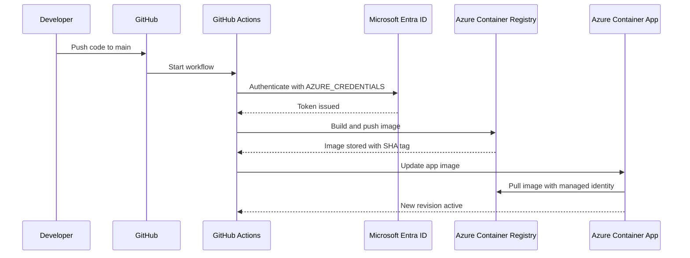

## Azure Container Apps CI/CD Guide

This guide explains how to build a Python application, push it to GitHub, build and push a container image to Azure Container Registry, and deploy it to Azure Container Apps using GitHub Actions.

---
### Solution Flow

1. Developer writes code locally.
2. Developer initializes Git and pushes code to GitHub.
3. GitHub Actions starts on push to `main`.
4. Workflow logs in to Azure using `AZURE_CREDENTIALS`.
5. Azure builds the container image in ACR.
6. Azure Container Apps updates to the new image.
7. The Container Apps environment identity pulls the private image with `AcrPull`.

### Architecture diagram


### CI/CD diagram



### Step 1: Azure Portal - Create the resource group

1. Open **Azure Portal**.
2. Search **Resource groups**.
3. Click **Create**.
4. Select your subscription.
5. Enter `RG-SAMPLE-DEV`.
6. Choose a region.
7. Click **Review + create**.
8. Click **Create**.

### Step 2: Azure Portal - Create Azure Container Registry

1. Search **Container registries**.
2. Click **Create**.
3. Select subscription and resource group `RG-SAMPLE-DEV`.
4. Enter registry name `sampledevacr`.
5. Pick a region.
6. Choose **Standard** SKU.
7. Leave **Admin user** disabled.
8. Click **Review + create** and then **Create**.

### Step 3: Azure Portal - Create the Container Apps environment

1. Search **Container Apps**.
2. Click **Create**.
3. Choose **Container Apps environment**.
4. Select `RG-SAMPLE-DEV`.
5. Name it `sampleapp-env`.
6. Choose region.
7. Create or select a **Log Analytics workspace**.
8. Click **Create** and wait.

### Step 4: Azure Portal - Create the Container App

1. Open **Container Apps**.
2. Click **Create** → **Container App**.
3. Choose environment `sampleapp-env`.
4. Name the app `sampleappdev`.
5. Set ingress as needed.
6. Set target port to `8080`.
7. Create the app.

### Step 5: Microsoft Entra - Create app registration in Portal

1. Open **Microsoft Entra ID**.
2. Go to **App registrations**.
3. Click **New registration**.
4. Name it `sampleappdev-github-actions`.
5. Click **Register**.

### Get IDs

On the app Overview page:
- Copy **Application (client) ID**
- Copy **Directory (tenant) ID**

### Create client secret

1. Open the app registration.
2. Go to **Certificates & secrets**.
3. Under **Client secrets**, click **New client secret**.
4. Add description `github-actions-secret`.
5. Click **Add**.
6. Copy the **Value** immediately.

### Step 6: GitHub - Create GitHub secret

1. Open your GitHub repository.
2. Click **Settings**.
3. Go to **Secrets and variables**.
4. Choose **Actions**.
5. Click **New repository secret**.
6. Set name to `AZURE_CREDENTIALS`.
7. Paste this JSON:

```json
{
  "clientId": "YOUR_APPLICATION_CLIENT_ID",
  "clientSecret": "YOUR_CLIENT_SECRET_VALUE",
  "subscriptionId": "YOUR_SUBSCRIPTION_ID",
  "tenantId": "YOUR_TENANT_ID"
}
```
### Step 6: Create workflow file in GitHub (optional if handled in the code)
You can create the workflow file from your local repository or directly in GitHub.
1. Open the repository in GitHub.
2. Go to the **Actions** tab, or open the `.github/workflows/` folder from the repository view.
3. Create a new file named `azure-container-apps.yml`.
4. Paste the workflow content from this guide.
5. Commit the file to the `main` branch, or create it locally and push it through Git.

### Step 7: AcrPull Role Assignment

### Why not AcrPush?

For this pipeline, `AcrPush` is not required for runtime deployment. The workflow builds and pushes the image through `az acr build`, while the deployed Container App only needs to **pull** the image. The important role for the Container Apps environment is `AcrPull`.

### Azure Portal steps to assign AcrPull

1. Open **Azure Container Registry** `sampledevacr`.
2. Go to **Access control (IAM)**.
3. Click **Add** → **Add role assignment**.
4. Select **AcrPull**.
5. Click **Next**.
6. Under **Members**, choose **Managed identity**.
7. Select the Container Apps environment identity for `sampleapp-env`.
8. Click **Review + assign**.

### Step 8 : Deployment 

### 1) Initialize Git

```bash
git init
git config --global user.name "Your Name"
git config --global user.email "you@example.com"
git remote add origin https://github.com/<user-or-org>/<repo>.git
```
### 2) First commit and push

```bash
git add .
git commit -m "Initial commit"
git branch -M main
git push -u origin main
```
### 3) Future changes from your computer

For later edits:

```bash
git add .
git commit -m "Update app logic"
git push
```

If using a feature branch:

```bash
git checkout -b feature/change-1
git add .
git commit -m "Update feature"
git push -u origin feature/change-1
```

---

### Step 8: Monitoring Deployment

### In GitHub Actions

1. Open repository **Actions**.
2. Click the latest workflow run.
3. Watch the logs for:
   - Checkout code
   - Azure Login
   - ACR build
   - Container App update

### What success looks like

- Azure login succeeds
- Image builds and pushes into ACR
- Container App update succeeds
- A new revision becomes active

### If deployment fails

Use the logs to identify whether the failure is:
- Login or authentication
- ACR build or push
- Container App revision update
- Image pull authorization

---

### Step 8: Validate the Deployed App

Validation should confirm both that the app is live and that it returns the expected response.

### Portal validation

1. Open **Container Apps**.
2. Open `sampleappdev`.
3. Copy the app URL.
4. Open the URL in your browser.
5. Confirm the app works - HTTP response is 200

### Log Analytics

Azure Container Apps sends application and system logs to Log Analytics. Use the workspace linked to the environment to query system and console logs, especially when diagnosing failed revisions.

---

### Troubleshooting Lessons

### Unauthorized image push
Earlier failures showed the image push step could fail with insufficient scopes. That was a build and push identity issue, not a runtime `AcrPush` requirement for the app itself.

### Image pull failure
The common runtime problem was missing `AcrPull` on the Container Apps environment identity.

### Secret problems
A wrong or missing `AZURE_CREDENTIALS` secret prevents Azure login.

### Revision failures
If a revision fails, check revision details, system logs, and log stream to find the failing container message.

### RBAC propagation
After role assignment, wait a few minutes before retrying because Azure RBAC may not be immediate.
